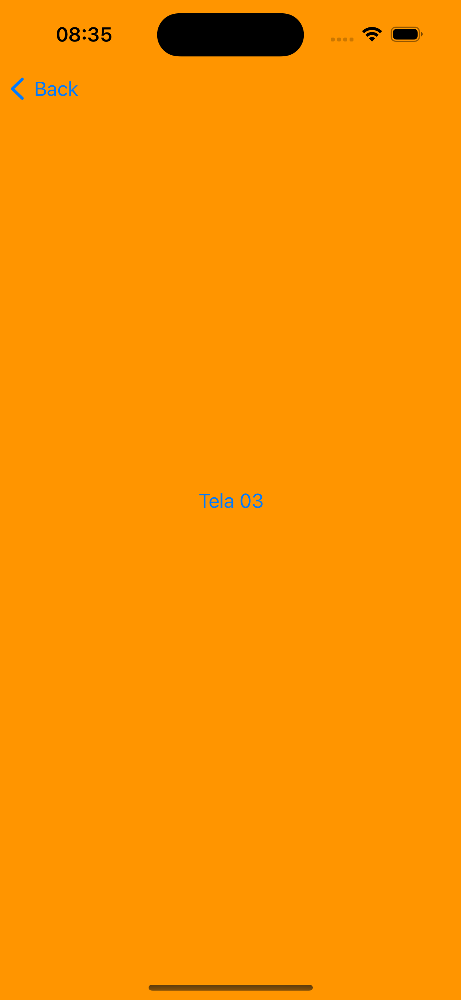
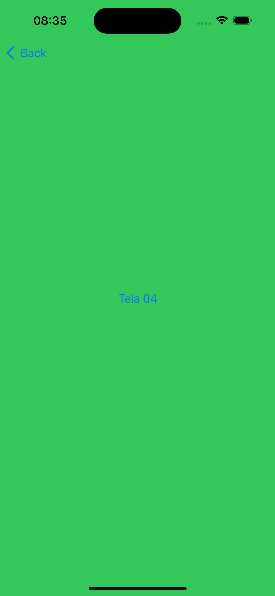
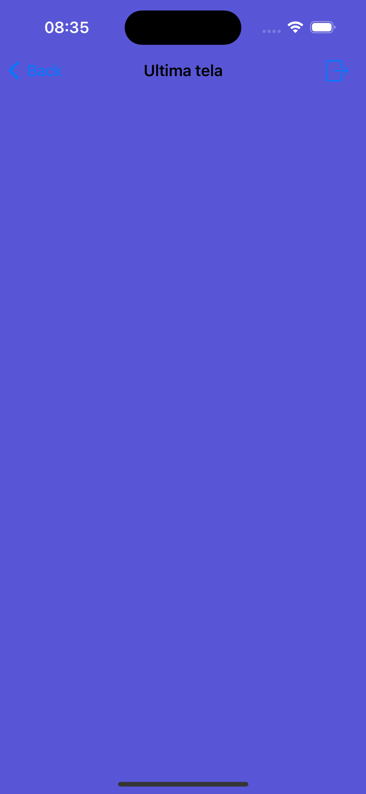

# 📱 SwiftUI Navegação de Telas 🚀

Um projeto simples e elegante de navegação entre telas usando `NavigationStack` no SwiftUI.  

  

---

## 🔹 **Sobre o Projeto**
Este projeto demonstra a navegação entre telas coloridas no SwiftUI, utilizando `NavigationStack` e `NavigationLink`. A cada clique, o usuário avança para uma nova tela, podendo retornar à anterior.  

📌 **Funcionalidades:**  
✔️ Transição entre múltiplas telas  
✔️ Uso de `NavigationStack`  
✔️ Layout minimalista e clean  

---

## 🛠 **Tecnologias Utilizadas**
- 💻 **Swift 5**  
- 📱 **SwiftUI**  
- 🔗 **NavigationStack & NavigationLink**

## 📸 Demonstração  

## 📸 Demonstração  

| Tela 1 | Tela 2 | Tela 3 | Tela 4 |
|--------|--------|--------|--------|
|  |  |  |  |
